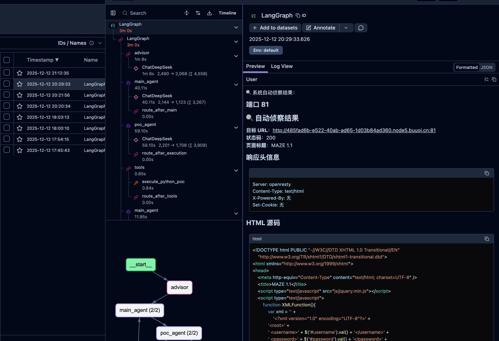
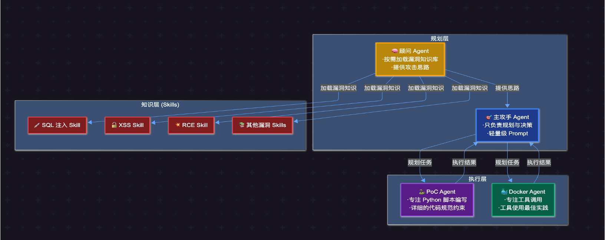

# 快速开始

## 1. 环境准备

```bash
# 克隆项目
git clone https://github.com/yhy0/CHYing-agent
cd CHYing-agent

# 安装依赖
uv sync
```

## 2. 配置环境变量

复制示例配置文件并编辑：

```bash
cp .env.example .env
```

必须配置的变量：

```bash
# DeepSeek API（主 LLM）
DEEPSEEK_BASE_URL="https://api.lkeap.cloud.tencent.com/v1"
DEEPSEEK_API_KEY="sk-xxx"

# Langfuse（可观测性平台，可选但推荐）
LANGFUSE_SECRET_KEY="sk-lf-xxx"
LANGFUSE_PUBLIC_KEY="pk-lf-xxx"
LANGFUSE_BASE_URL="https://us.cloud.langfuse.com"
```

其他变量使用默认值即可。

## 3. 启动 Kali Docker 容器

```bash
cd docker
docker-compose up -d
```

> **注意**：容器名 `kali-pentest` 建议保持不变。如需修改，请全局搜索 `kali-pentest` 并替换。

## 4. 运行 Agent

```bash
# 单目标模式 - 直接指定目标进行渗透测试
uv run main.py -t http://192.168.1.100:8080

# 单目标模式 + 重试（失败后自动重试 3 次）
uv run main.py -t http://192.168.1.100:8080 -r 3

# 比赛模式 - 通过 API 获取题目，持续运行
uv run main.py -api
```

### 测试说明

- **单目标模式**：已使用 [BUU XXE COURSE 1](https://buuoj.cn/challenges#BUU%20XXE%20COURSE%201) 测试通过，只测试了这一个，看能做出来，就没有测试其他的了，还没有完整的对当前大修后的流程进行测试，可能还存在问题，等我有时间再搞吧，
- **比赛模式**：可使用 [Neuro-Sploit 出品的模拟比赛环境](https://github.com/Neuro-Sploit/tencent-cloud-hackathon-intelligent-pentest-competition-api-server) 进行测试，这次大修后，我没有对这个模式进行完整的测试，所以可能存在问题，比赛期间有大佬搞了一个模拟比赛环境的，哪个大佬有闲情搭建起来可以拉我玩玩，我有空了再来调试[旺柴]


> 带娃，工作，时间不是很多，这个版本本来说是上周六，周末搞好的发出来额度，结果拖了一周才搞


## 5. 日志

- **主日志**：`logs/` 目录
- **题目日志**：`logs/challenges/` 目录（每题独立记录，便于复盘）
- **Langfuse**：推荐使用，提供完整的 LLM 调用链路追踪

> 本来想让claude code 帮我实现 [Antix](https://github.com/chainreactors/tinyctfer) 大佬的做法，使用 Jupyter Notebook (.ipynb) 记录，claude code 分析了一下当前已经使用 [Langfuse](https://us.cloud.langfuse.com/)了，对于每个流程已经很详细了，不需要做，那就不改了[旺柴]



---

## 关键配置

| 变量 | 默认值 | 说明 |
|------|--------|------|
| `MAX_ATTEMPTS` | 70 | 单题最大尝试次数 |
| `MAX_CONCURRENT_TASKS` | 8 | 最大并发任务数 |
| `SINGLE_TASK_TIMEOUT` | 900 | 单题超时（秒） |
| `AUTO_SUBMIT_FLAG` | true | 自动 FLAG 提交（兜底机制） |
| `FETCH_INTERVAL_SECONDS` | 600 | 拉取题目间隔（秒） |
| `MAX_RETRIES` | 4 | 最大重试次数（共 5 次机会） |

---

## 项目结构

```
CHYing-agent/
├── main.py                      # 主程序入口（-t 单目标 / -api 比赛模式）
├── chying_agent/                # 核心代码
│   ├── graph.py                 # LangGraph 状态机（三层架构）
│   ├── state.py                 # 状态定义（含消息压缩）
│   ├── challenge_solver.py      # 单题解题逻辑
│   ├── scheduler.py             # 调度器（定时拉取、状态监控）
│   ├── retry_strategy.py        # 重试策略（角色互换）
│   ├── task_manager.py          # 任务生命周期管理
│   ├── task_launcher.py         # 任务启动器
│   ├── langmem_memory.py        # 记忆系统（LangMem）
│   ├── prompts_book.py          # Prompt 模板管理
│   │
│   ├── agents/                  # Agent 系统提示词
│   │   ├── advisor.py           # 顾问 Agent（策略建议）
│   │   ├── main_agent.py        # 主 Agent（规划调度）
│   │   ├── poc_agent.py         # PoC Agent（Python 脚本执行）
│   │   └── docker_agent.py      # Docker Agent（Kali 工具执行）
│   │
│   ├── tools/                   # LangChain 工具
│   │   ├── shell.py             # Shell 命令执行（execute_command）
│   │   ├── shell_enhanced.py    # Python PoC 执行（execute_python_poc）
│   │   ├── memory_tools.py      # 记忆工具（LangMem 集成）
│   │   └── competition_api_tools.py  # 比赛 API（题目获取、FLAG 提交）
│   │
│   ├── executor/                # 命令执行器
│   │   ├── docker_native.py     # Docker 原生执行器
│   │   ├── docker_python_wrapper.py  # Docker Python 包装器
│   │   └── microsandbox.py      # Microsandbox 沙箱执行器
│   │
│   ├── skills/                  # 技能模块（按需加载）
│   │   └── skill_loader.py      # 漏洞知识库加载器
│   │
│   ├── utils/                   # 工具函数
│   │   ├── recon.py             # 自动侦察
│   │   ├── flag_validator.py    # FLAG 格式验证
│   │   ├── failure_detector.py  # 失败检测
│   │   └── rate_limiter.py      # 速率限制
│   │
│   └── core/                    # 核心配置
│       ├── constants.py         # 常量定义
│       └── singleton.py         # 单例管理
│
└── docker/                      # Docker 配置
    └── docker-compose.yml       # Kali 容器配置
```

---

## 架构说明

采用三层架构设计：

1. **规划层**：主 Agent 只负责规划决策，不直接执行命令
2. **执行层**：PoC Agent、Docker Agent 专注执行，返回精简结果
3. **知识层**：参考 [Claude Code Skills](https://code.claude.com/docs/zh-CN/skills) 设计，顾问按需加载漏洞知识库



### 核心工具

| 工具 | 说明 |
|------|------|
| `execute_command` | 在 Kali Docker 中执行 Shell 命令 |
| `execute_python_poc` | 执行 Python 漏洞利用脚本 |
| `submit_flag` | 提交 FLAG 到比赛平台 |

### TODO

- [ ] Docker Agent 的 Kali 工具精简及描述优化

我的想法是按照我自己的渗透思路，将一些常用的写到 docker agent 的 prompt 中

---

## 致谢

- [LangGraph](https://github.com/langchain-ai/langgraph) - 工作流编排框架
- [LangMem](https://github.com/langchain-ai/langmem) - 记忆系统
- [Langfuse](https://langfuse.com/) - LLM 可观测性平台
- [DeepSeek](https://www.deepseek.com/) - 主 LLM 模型
- [腾讯云黑客松智能挑战赛](https://zc.tencent.com/competition/competitionHackathon?code=cha004)

---

## License

MIT License

---

**⚠️ 免责声明**：本项目仅用于教育和研究目的，请勿用于非法用途。使用本项目进行渗透测试时，请确保已获得目标系统的授权。
