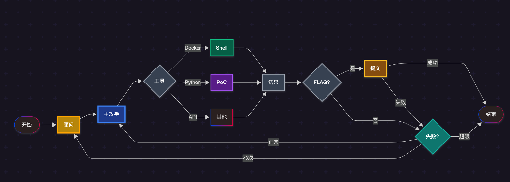
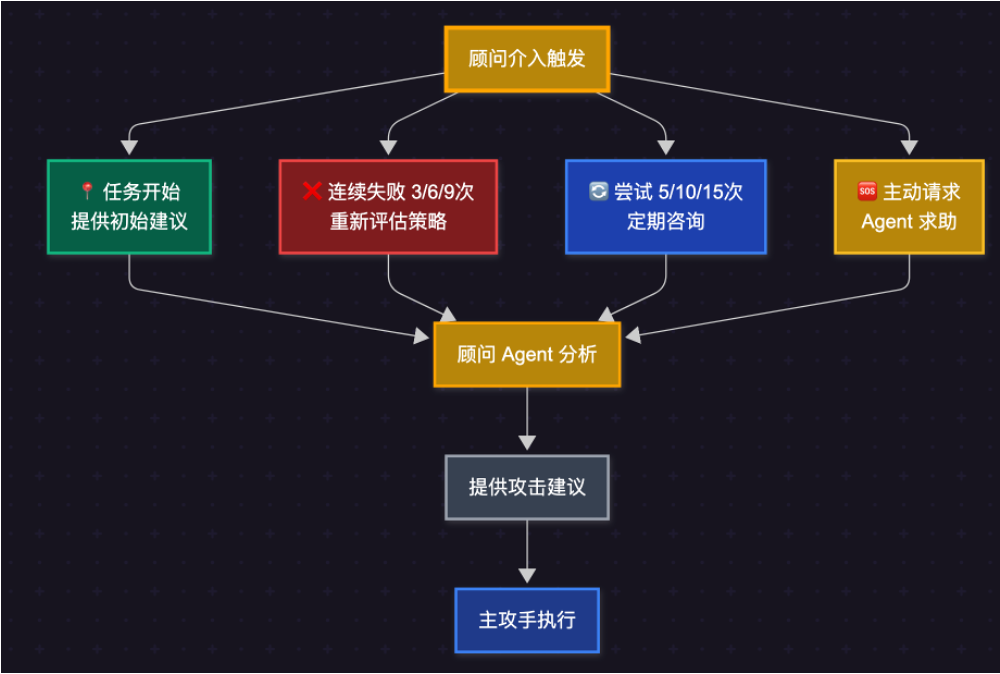
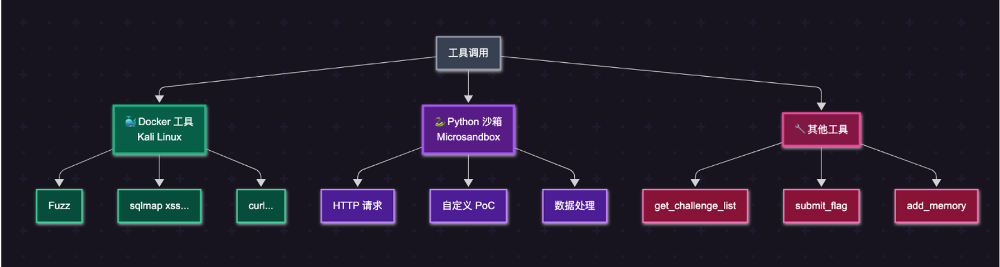
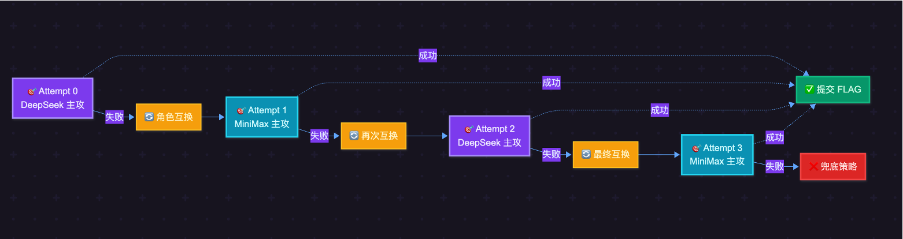
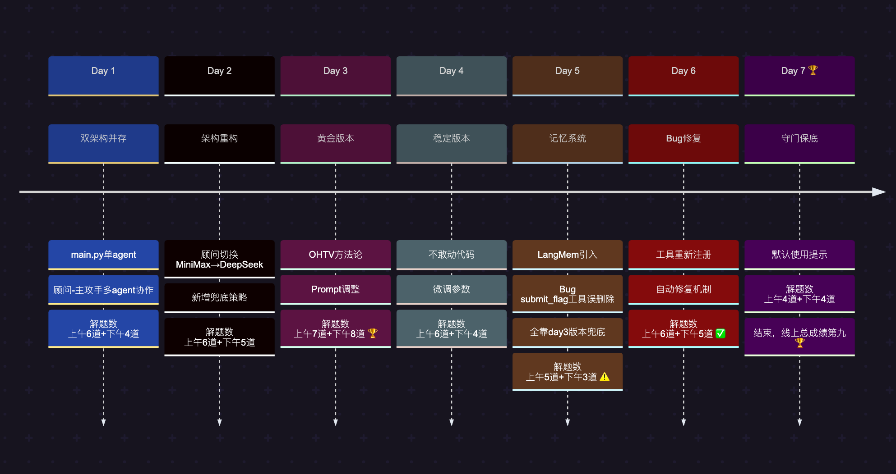

# 7天，Top 9：我如何让 Claude 手搓一个全自动 CTF 选手

> **"7天时间，我没有写一行核心代码，而是让 Claude 帮我造了一个会打 CTF 的 AI。"**
>
> 腾讯云黑客松 · 智能渗透挑战赛 **第 9 名**
>
> 没有复杂的 MCP 工具链，没有精心封装的工具库。这是一份关于「少即是多」的实战报告：为什么三个工具就够 AI 打 CTF？

[](https://github.com/langchain-ai/langgraph) [](https://www.python.org/) [](https://www.deepseek.com/) [](LICENSE)

---

## 核心亮点：AI 构建 AI Agent

**这个项目本身就是 AI 能力的最佳证明。**

ChYing Agent 是一个「AI 辅助 AI」的产物。作为选手，我负责提供专业的渗透思路和架构设计，而具体的代码实现，大部分由 Claude 根据比赛文档和设计指令完成。

**用好 AI，是个人能力的放大器**。

---


## 赛前

报名时，我最初想搞一个「豪华」的多 Agent 系统，配一堆本地工具和 MCP 接口，把所有输出格式化好喂给模型。

后来看到 [Cyber-AutoAgent](https://github.com/westonbrown/Cyber-AutoAgent) 直接把 Kali 挂进来用，我才意识到：何必造那么多半残废的小轮子？不如把复杂度交给 LLM，让它直接用 Kali 里的各种工具、自己写 Python 脚本——这才和现实世界一致。

所以在比赛前一晚，我让 Claude 帮我把架构整个重写了一遍：从多 Agent 收敛成一个清晰的单 Agent 主流程，去掉一大堆臃肿的工具封装，把决策权尽量交给模型。

做出一个 demo 题验证逻辑没问题后，周一比赛开始就直接上赛场。第一天的成绩有点出乎预料——本来想着重在参与，玩一玩，没想到上午最高冲到了第 4 名，结束时排第 8。

这个结果让我确认了一件事：**这套打法是可行的，甚至很有潜力**。所以我才决定接下来几天继续在这个架构上深挖。

## 设计思路

### 双 Agent 协作架构：顾问与主攻手的分工（核心机制）



与其他选手不同，我设计了一个**顾问 Agent**——它不直接执行命令，只负责提供建议。为什么这样设计？

#### 问题：长对话带来的幻觉

在平时用各种 LLM 写代码时，我发现总是存在一个问题：
- 对话轮次一多、上下文一长，模型开始幻觉、夸大、脑补不存在的接口和结果
- **它会越来越自信，但不一定越来越正确**

#### 我的日常做法：多轮 Review

我几乎从不「盲信」模型的每一次回答：
1. 先让模型写出方案或代码
2. 我人工审一遍结论
3. 人工不确定的地方提出来再让模型自我 review 一遍
4. 有时再拉另一个模型做交叉 review

这套「人 + 多模型 review」的流程，帮我揪出了很多隐藏问题。

#### 比赛中的落地：顾问 Agent

我希望把这套经验固化成系统能力，而不是靠人肉盯盘，而且比赛期间也不允许人来参与干扰 agent 的运行（断网模式，只能通过排行榜变化来猜测 Agent 的状态）。所以我引入了一个专门的顾问 Agent：
- 不直接调用工具，只负责站在更高一层审视当前策略
- 当主 Agent 对同一道题的对话轮次过多，或者主动求助时，顾问介入
- 给出不同视角的分析和建议，帮助打破思维定势、压低长对话下的幻觉风险

这个设计其实还打算模拟现实 CTF 组队的场景：多人协作、头脑风暴、各有所长。**多 LLM 协作，防止单模型陷入牛角尖。**

### 核心思想：「不完全信任」的工程哲学

这个双 Agent 设计背后，是我在比赛中形成的一个核心工程哲学：**对 LLM 保持「不完全信任」**。

```
完全信任 LLM   → 系统脆弱，一个幻觉就崩溃
完全不信任 LLM → 系统僵化，失去 AI 的灵活性
不完全信任 LLM → 系统稳健，AI 能力 + 确定性兜底
```

这不是对 AI 能力的否定，而是一种务实的工程态度。

> **关于 AI 能力边界的思考**
>
> 这一观点深受 [AI for Coding](https://mp.weixin.qq.com/s/HaazAEMGqH1GBTmn9qI73g) 一文的启发：
>
> **AI 擅长解决「已知的未知」**（你没写过，但世界上有人写过的问题）；**它无法解决「未知的未知」**（完全孤立的业务逻辑或物理世界的全新问题）。
>
> CTF 题目恰好大多属于前者：漏洞类型是已知的，攻击手法是有迹可循的，这正是 LLM 能发挥作用的领域。

#### 顾问的介入时机

顾问介入有 4 种触发机制：

1. **任务开始时**：顾问提供初始建议，避免盲目尝试
2. **连续失败时**：失败 3 次、6 次、9 次时，顾问重新评估策略
3. **定期咨询**：每 5 次尝试定期咨询，防止主攻手陷入思维定式
4. **主动求助**：LLM 自己意识到卡住了，主动请求顾问介入




## 工具体系：让 LLM 自己选武器

我设计了三类工具：

1. **Kali Docker 工具**：sqlmap、ffuf、curl 等专业渗透工具，开箱即用
2. **Python 脚本执行**：很多漏洞利用需要多步组合（构造 payload、发送请求、解析响应），用 Python 脚本处理更灵活，而且 LLM 写 Python 的能力很强。原本计划用 Microsandbox 沙箱，但比赛云环境不支持，最后也是在 Docker 里执行 Python——核心能力没变：**LLM 想写什么代码就写什么代码**
3. **API 工具**：负责题目管理和记忆系统

### 设计思考：为什么「简单」往往更有效？

这套设计的核心思路是：不要用一堆 MCP 工具限制 LLM 的选择空间、让工具描述占用绝大部分 token，而是让 LLM 自己选武器、写招式。

回顾这次比赛，我发现一个有趣的现象：**越简单的设计，往往越有效**。

为什么？因为 LLM 本质上是一个「模式匹配器」，而不是「推理引擎」：
- 工具越多 → LLM 需要匹配的模式越复杂 → 出错概率越高
- 工具越少 → LLM 的决策空间越清晰 → 执行越稳定

所以我的工具设计原则是：**给 LLM 最少的选择，但每个选择都足够强大**。

三个工具就够了：
1. `execute_command` — 执行任何 Kali 命令
2. `execute_python_poc` — 执行任何 Python 代码
3. `submit_flag` — 提交答案

这不是偷懒，而是刻意为之。把复杂度交给 LLM 的「知识」，而不是交给「工具数量」。



### 实验性探索：动态角色互换

我在比赛中还尝试了一个兜底策略，主要用于两小时后进行突破，预期是解答出常规方式未解答出来的题目。

当一次攻击失败，单纯的重试可能无效。所以我设想了一个「角色互换」机制：第一轮 DeepSeek 主攻失败，第二轮就换 MiniMax 主攻、DeepSeek 退居幕后做参谋，反复轮换。

理论上这能利用不同模型的推理强项来突破死锁。

> **实际效果**：这还是一个实验性的功能。由于硅基流动的 api 比赛第二天晚上调试了忘记关了，跑了一夜，导致没钱了，比赛期间未能充分验证多模型轮换的效果，最终主要还是依靠 DeepSeek 自身的能力。但这套机制在未来的多模型协作中仍有探索价值。



## 版本演变时间线



---

## 回顾与思考

回顾这次比赛，我认为做对了几件事：

- **顾问 Agent 的设计**：模拟了我日常使用 LLM 的习惯——从不盲信 LLM 的回答
- **极简的工具设计**：放弃复杂封装，直接让 LLM 用 Kali 工具，降低 MCP 工具带来的上下文干扰
- **把主动权交给 LLM**：让它自己规划攻击步骤
- **兜底策略**：在关键时刻救回了多道题

### 当前问题与未来规划

当前设计存在一个问题：主 Agent 的 Prompt 里混杂了太多东西——解题策略、Python 规范、Docker 用法、漏洞知识。这加重了它的认知负担，比赛中通过日志来看，出现了很多次 Python 代码格式错误、工具误用等问题。

接下来我计划重构为分层架构：

1. **主 Agent 只负责规划**：执行交给 PoC Agent、Docker Agent 等子 Agent
2. **子 Agent 专注执行**：在 prompt 中根据功能不同进行详细约束，只返回结果给主 Agent，保证主 Agent 上下文的干净
3. **按需加载知识**：参考 [Claude Code](https://code.claude.com/docs/zh-CN/skills) 中 Skills 的设计思路（按需激活特定能力），让顾问按需加载漏洞知识库，而不是一次性塞给主 Agent


---

## 结语

这次比赛让我意识到，用好 AI 的关键不是让它做所有事，而是识别出哪些问题属于它的「舒适区」——那些人类已经解决过、有大量训练数据的问题。渗透测试的大部分场景恰好符合这个条件。

如果你也在探索 AI Agent 的可能性，希望这份实战记录能给你一些启发。项目已开源，欢迎交流。

## 参考

- [langgraph](https://docs.langchain.com/oss/python/langchain/multi-agent)
- [Cyber-AutoAgent](https://github.com/westonbrown/Cyber-AutoAgent) 
- [AI for Coding：从 Vibe Coding 到规范驱动开发](https://mp.weixin.qq.com/s/HaazAEMGqH1GBTmn9qI73g)


## 快速开始

详见 [QUICKSTART.md](QUICKSTART.md)

