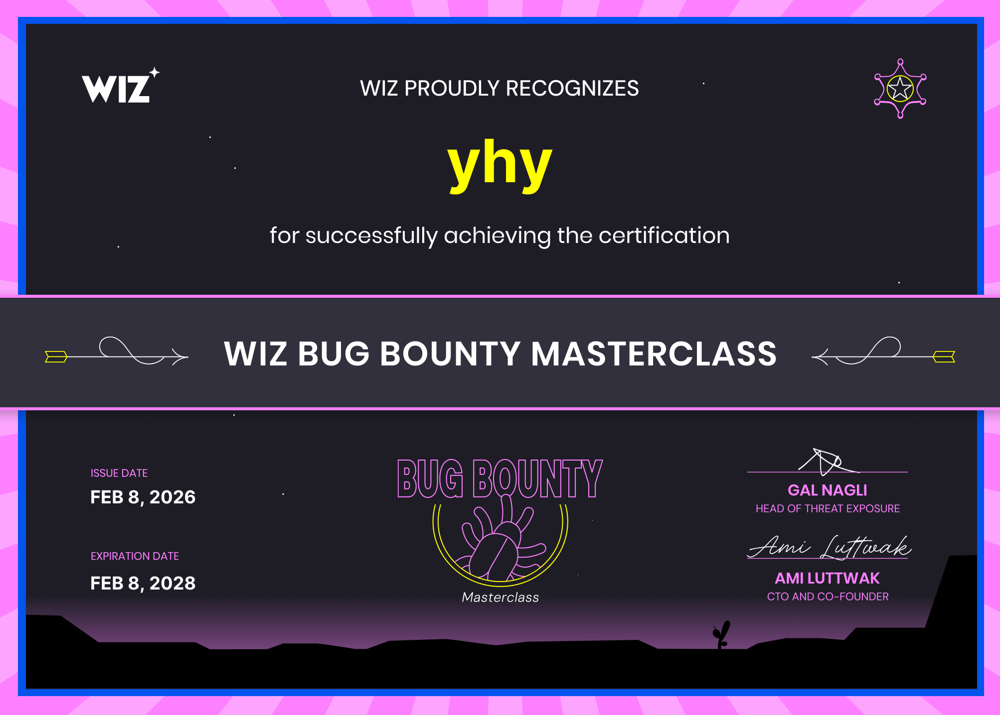
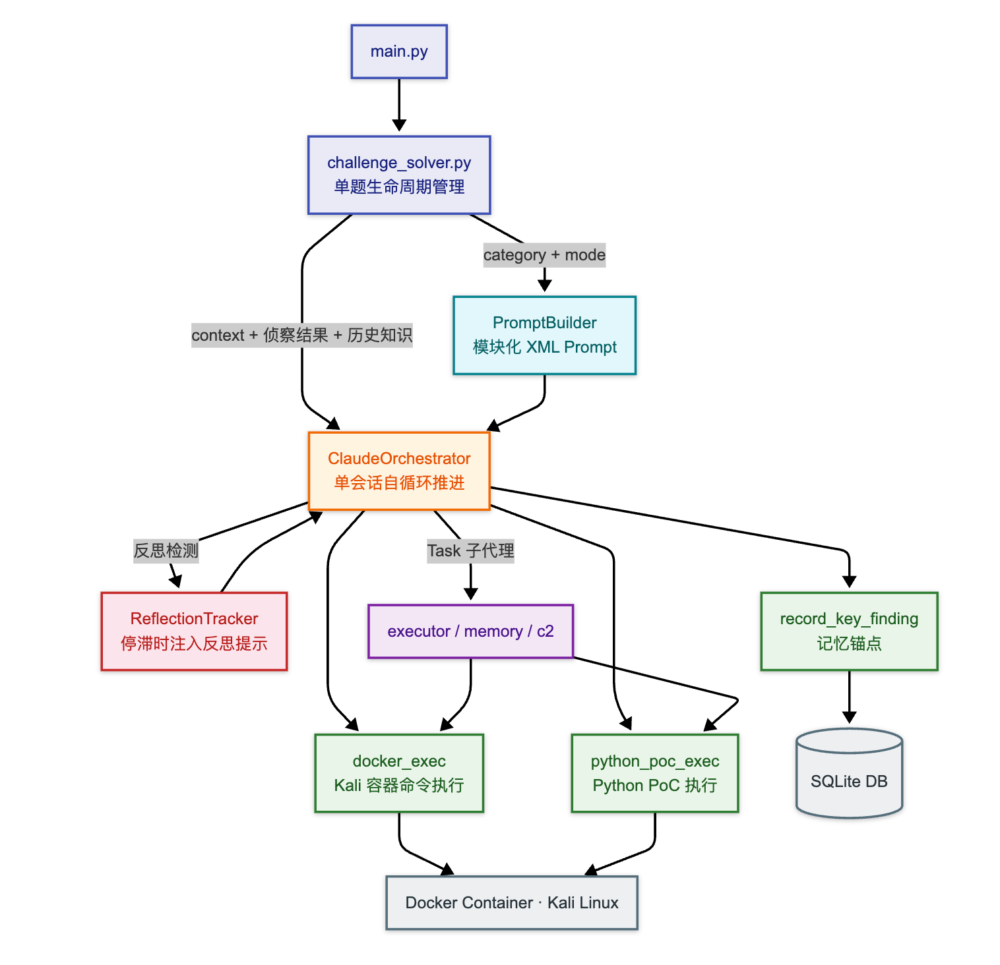

# 承影 Agent V3 通关 Wiz Bug Bounty Masterclass 记录

> 用 GLM-4.7，零人工干预，9/9 通关 Wiz Bug Bounty Masterclass，拿到认证。
>
> 这篇文章是对 V1（腾讯云黑客松 Top 9）和 V2（阿里云 CTF 全军覆没）之后的第三篇实战报告

---

## 前情提要

如果你没看过前两篇，这里是 30 秒回顾：

**[V1 (腾讯云黑客松）](https://mp.weixin.qq.com/s/fWWVMTySJMpyKt62BBsDdA)**：LangGraph 双 Agent 架构，DeepSeek 驱动，7 天拿下第 9 名。核心发现：三个工具就够 AI 打 CTF。

**[V2（阿里云 CTF）](https://mp.weixin.qq.com/s/AeQz4UA8cFWDM15p3xw_3g)**：26 题 0 解。我试图用工程复杂度换 Agent 能力——Advisor + Main Agent 的参谋制、自制上下文压缩、多模型轮换——结果复杂度反过来吃掉了能力。比赛第一天晚上紧急重构为 V3（Claude SDK 单决策者架构），但还没有进行验证。

这一次，V3 被第一次验证了——2026 年 2 月 8 日，Wiz Bug Bounty Masterclass，9/9。

---

## 一、为什么选 Wiz Bug Bounty Masterclass

起因是刷到了陈广师傅的两张 Wiz 证书截图。

Wiz 是云安全领域大名鼎鼎的公司，他们推出的 [Bug Bounty Masterclass](https://www.wiz.io/bug-bounty-masterclass#real-world-hacks) 包含 9 道基于真实漏洞复现的挑战题。我一看就心动了——正好拿来验证 V3 架构。

Wiz 有两套挑战：[Bug Bounty Masterclass](https://www.wiz.io/bug-bounty-masterclass#real-world-hacks) 和 Cloud Security Championship。后者全是[云安全](https://cloudsecuritychampionship.com/)（AWS/GCP/Azure），云安全的第一题看着是需要在浏览器上操作的，承影 Agent 目前还不具备这个能力，所以先挑了前者。

9 道题的概况：

- **来自真实 Bug Bounty 生涯**，涵盖 AI 初创公司、航空公司、银行、物流、游戏公司、金融科技、CRM 等行业

- 涵盖 OSINT、目录枚举、Blind XSS、SSRF、子域接管、堆内存泄露、Cookie 混淆、GitHub 信息泄露等漏洞类型

- 完成全部 9 题可获得认证证书

  https://www.wiz.io/bug-bounty-masterclass/certificate/e814db9f-92d3-49b6-a165-de80b76667e5

- 

---

## 二、V3 架构

### 核心思路

V3 不是推翻重来，而是在阿里云失败后继续做减法。

```
V1: LangGraph + 双 Agent + DeepSeek            → 腾讯云 Top 9
V2: Advisor + Main Agent + 自制上下文压缩        → 阿里云 0 解
V3: Claude SDK 单会话自循环 + MCP 工具 + 反思机制 → Wiz 9/9 通关
```

完整架构：



**只有一个决策者**。没有 Advisor，没有多 Agent 路由，没有 LangGraph。

Orchestrator 禁用了 Bash/Write/Edit 等高风险工具，所有操作强制通过 MCP 工具在 Docker 容器中执行——这既是安全约束，也是「少即是多」的设计选择：**给 LLM 最少的选择，但每个选择都足够强大。**

---

## 三、9 题通关记录

模型：**GLM-4.7**（智谱 AI）。朋友给了我他的账户让我免费使用，在此非常感谢。

https://github.com/Peppererer

https://github.com/L0nm4r
以及他们的公众号 烫烫烫安全 ，最近他们太懒了，更新都没有我勤快

除了 GitHub Authentication Bypass 给了原始题目描述外，其余 8 题**只给了 URL，没有任何额外提示**。

### 解题数据

| # | 挑战 | 原始赏金 | 漏洞类型 | 工具调用 | 成功成本 | 尝试 |
|---|------|----------|----------|---------|----------|------|
| 1 | Open Deepseek Database | >1M records | 未认证数据库暴露 | 36 | $0.19 | 1次 |
| 2 | Major Airline Data Dump | $3,000 | API 数据泄露 | 30 | $0.47 | 1次 |
| 3 | Domain Registrar Data Exposure | $5,000 | 目录遍历/敏感文件 | 17 | $0.20 | 2次 |
| 4 | Logistics Admin Panel Compromise | $18,000 | Blind XSS | 39 | $0.36 | 1次 |
| 5 | Root Domain Takeover on Fintech | $2,000 | 子域接管(S3) | 15 | $0.09 | 1次 |
| 6 | SSRF on Major Gaming Company | $27,500 | SSRF | 42 | $0.65 | 1次 |
| 7 | Github Auth Bypass on Major CRM | $12,000 | GitHub OSINT | 145 | $2.16 | ~10次 |
| 8 | Breaking into a Major Bank | $4,800 | 堆内存泄露(heapdump) | 17 | $0.12 | 2次 |
| 9 | 0 Click Account Takeover | $20,000 | Cookie 混淆/Session 隔离 | 57 | $0.63 | 1次 |

**9 题成功 run 的 API 成本：$4.87**（表格中每题成功那次 run 的费用之和）。

加上所有失败和重复尝试（调试 bug、环境问题、策略错误等），**实际总成本约 $21.28**（成功 $4.87 + 失败/重试 $16.41）。失败成本主要集中在 GitHub 那题——多次尝试因为缺少认证 token 反复失败，以及开发过程中一些 bug 导致的无效执行。

### 逐题复盘

#### Challenge 1: Open Deepseek Database

**一句话**：扫描端口，发现未认证的 ClickHouse 数据库，直接查询提取 flag。

这是最简单的一题。Agent 用 nmap 扫到开放端口，识别出 ClickHouse，然后用 curl 直接查询。36 次工具调用，$0.19，干净利落。

#### Challenge 2: Major Airline Data Dump

**一句话**：发现暴露的 API 端点，遍历参数提取乘客数据中的 flag。

Agent 先做 Web 侦察，发现 API 接口，然后通过参数枚举找到了泄露的乘客数据。典型的 API 安全问题。

#### Challenge 3: Domain Registrar Data Exposure

**一句话**：目录爆破发现隐藏文件夹，从中提取敏感数据。

Agent 第一次尝试用了 100 次工具调用、$0.92，最后给了一个臆想的 flag。第二次换了更精确的目录枚举策略，17 次工具调用、$0.20 就找到了正确答案。教训：LLM 的幻觉问题在安全场景尤其危险——它会在找不到 flag 时「编」一个出来。

#### Challenge 4: Logistics Company Admin Panel Compromise

**一句话**：利用客户支持系统的 Blind XSS 窃取管理员 Cookie，进入后台提取 flag。

这题的关键洞察是：客户提交的内容会被管理员在后台查看——这创造了 XSS 的注入点。Agent 构造了 XSS payload，等待管理员触发，窃取 Cookie，然后用 Cookie 登录管理后台。39 次工具调用，一气呵成。

#### Challenge 5: Root Domain Takeover on Fintech

**一句话**：发现悬挂的 DNS CNAME 指向已释放的 S3 bucket，接管子域。

这是最快的一题。Agent 查了 DNS 记录，发现 CNAME 指向一个不存在的 S3 bucket，立刻识别出子域接管的机会。15 次工具调用，$0.09。

#### Challenge 6: SSRF Vulnerability on Major Gaming Company

**一句话**：利用内容获取服务的 SSRF 漏洞访问云元数据端点，提取内部凭证和 flag。

经典 SSRF 题。Agent 发现服务接受 URL 参数并获取内容，于是构造请求访问 `http://169.254.169.254/latest/meta-data/` 等云元数据端点，最终从内部服务中提取了 flag。

#### Challenge 7: Github Authentication Bypass on Major CRM

**一句话**：在 GitHub 上搜索 `bugbountymasterclass.com`，找到员工意外提交的 `.env` 文件中的泄露 token。

**这是唯一一题我给了原始题目描述的**，也是最曲折的一题。

前面多次尝试全部失败。根因分析：
1. Agent 没有 `GH_TOKEN`，无法使用 GitHub Code Search API（需要认证）
2. 即使有 token，Agent 也不知道容器里有这个资源可用
3. Agent 退而求其次用 WebSearch，但搜索引擎不会索引 `.env` 文件

这个失败直接催生了两个改进：
- **DOCKER_PASSTHROUGH_ENV**：白名单机制将环境变量注入容器
- **Context 注入**：在 Agent 的 prompt 中明确告知可用的认证资源

修复后 Agent 直接用 `curl -H "Authorization: token $GH_TOKEN"` 调用 GitHub Code Search API，搜到了泄露的 `.env` 文件，提取 token，通过验证，拿到 flag。最终成功那次用了 145 次工具调用、$2.16。

**这题的意义超越了解题本身**——它暴露了 Agent 系统中「知道什么」和「能做什么」之间的鸿沟。光有能力（环境变量已注入）不够，还需要让 Agent **意识到**自己有这个能力。

#### Challenge 8: Breaking into a Major Bank

**一句话**：发现暴露的 Spring Boot Actuator `/heapdump` 端点，从堆内存中提取内部凭证和 flag。

Agent 先做端点枚举，发现了 `/actuator/heapdump`，下载了堆转储文件，然后用 `strings` 和正则在堆内存中搜索 flag 和凭证。第一次尝试用了 92 次工具调用、$0.91，但返回 `flag=null`——找到了关键信息却没能正确提取。第二次重新做题后，17 次工具调用、$0.12 就成功了。

#### Challenge 9: 0 Click Account Takeover via Cookie Switching

**一句话**：利用 staging 和 production 环境之间的 Session 隔离缺陷，用 staging 的 Cookie 接管 production 账户。

Agent 发现两个环境共享同一个认证系统但隔离不严格，在 staging 环境注册账号获取 Cookie，然后将 Cookie 应用到 production 环境，成功以 admin 身份登录，提取 flag。57 次工具调用，逻辑清晰。

---

## 四、从三篇文章看演化路径

### V1（腾讯云）：发现了正确的直觉

- 三个工具就够 AI 打 CTF
- 极简优于复杂
- 把主动权交给 LLM

### V2（阿里云失败）：用复杂度验证了直觉的反面

- 多 Agent 协作的决策冲突
- 自制上下文管理的灾难
- AI 写的代码不 review 的代价

### V3（Wiz 通关）：重新验证了 V1 的直觉，但换了更好的底座

V1 → V3 的本质变化：

| 维度 | V1 (LangGraph) | V3 (Claude SDK) |
|------|----------------|-----------------|
| 编排层 | LangGraph 图 | Claude SDK 单会话 |
| 决策者 | 2个（Advisor + Main） | 1个（Orchestrator） |
| 上下文管理 | 自制压缩 | SDK 原生能力 |
| 工具调用 | 自封装 MCP | 进程内 MCP + Docker 隔离 |
| 反思机制 | 无 | PostToolUse Hook |
| 记忆 | 无 | transcript + DB discoveries |

直觉没变，工程实现更干净了。

---

## 五、仍然存在的问题

通关不代表完美，而且 Wiz 这 9 题的难度和阿里云 CTF 相比还是偏简单的——漏洞类型明确、靶场环境可控、没有复杂的多层渗透链。所以这次结果不能直接和阿里云 CTF 的 0 解相对比，但这次的利落程度来看，还挺有效的。

以下是这次测试中暴露的问题：

### 1. Agent 不会自主探索执行环境

GitHub 题暴露了一个深层问题：Agent 的能力（容器内有 `GH_TOKEN`）和认知（Agent 不知道有 `GH_TOKEN`）之间存在断层。

我通过在 context 中注入环境变量列表修复了这个具体问题，但它反映的是一个新的缺陷：**Agent 不会主动探索自己的执行环境**——它不会去查看有哪些环境变量可用、容器里装了什么工具、网络能访问哪些资源。目前不确定这是模型能力的问题还是 prompt 约束的问题，可能两者都有。

### 2. Flag 提取的假阳性

Challenge 3 中 Agent 在找不到 flag 时编造了一个，Challenge 8 中 Agent 找到了关键信息但返回 `flag=null` 没能正确提取。flag 验证逻辑需要加强——至少应该检查 flag 格式是否符合预期模式。

### 3. 缺少浏览器操作能力

Wiz 的另一套挑战 Cloud Security Championship 的第一题就需要在浏览器中操作，承影 Agent 目前所有操作都通过指定题目链接命令行完成，还无法处理需要浏览器交互的场景。这是下一步要补的能力。

---

## 六、一些思考

基于三次实战（一次成功、一次失败、一次通关），记录几个对我自己有用的认识：

**1. 先做减法，再考虑加法。**
如果一个 Agent 解决不了问题，大概率不是因为 Agent 不够多。先检查是不是自己绑住了 Agent 的手脚。

**2. 上下文管理交给专业的来。**
不要自己写 token 压缩。不要自己管理对话历史。用 SDK 提供的能力。我在 V2 里踩过这个坑——自制的上下文压缩直接导致了 Agent 「失忆」。

**3. 让 Agent 知道自己有什么。**
能力 ≠ 认知。你给 Agent 配了工具、注入了环境变量，但如果 prompt 里没告诉它，这些就不存在。

---

## 结语

从腾讯云 Top 9，到阿里云 0 解，再到 Wiz 9/9 通关——这不是一个线性进步的故事，而是一个「走弯路然后找回来」的故事。

V2 的失败教会我一件事：**复杂度不是能力**。V3 的通关初步验证了另一件事：**做对减法，比做对加法更难，也更有价值。**

下一步？把承影 Agent 拉到更复杂的实战场景中去——Cloud Security Championship、阿里云 CTF 的遗留题目、自动化内外网渗透——不是为了证明什么，而是为了继续找到它的边界。

---

*时维乙巳，序属季冬，记于 Wiz Bug Bounty Masterclass 通关之后*

> 证书链接：https://www.wiz.io/bug-bounty-masterclass/certificate/e814db9f-92d3-49b6-a165-de80b76667e5
>
> 项目地址：https://github.com/yhy0/CHYing-agent
>
> V1 文章：[7天Top 9：我如何让 Claude 手搓一个全自动 CTF 选手](https://mp.weixin.qq.com/s/fWWVMTySJMpyKt62BBsDdA)
>
> V2 复盘：[阿里云 CTF 2026 失败复盘：当我试图用复杂架构"驾驭"承影 Agent](https://mp.weixin.qq.com/s/AeQz4UA8cFWDM15p3xw_3g)
