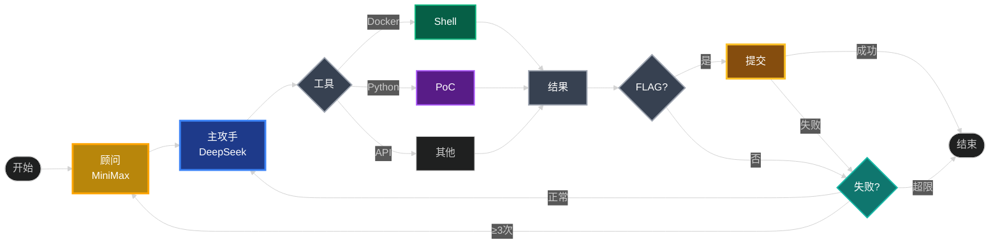
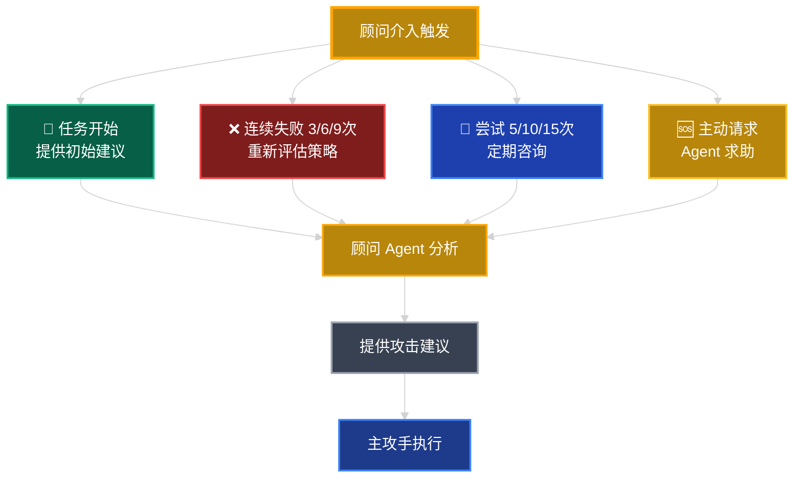
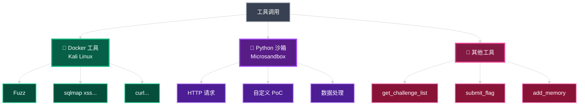
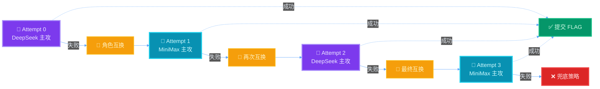
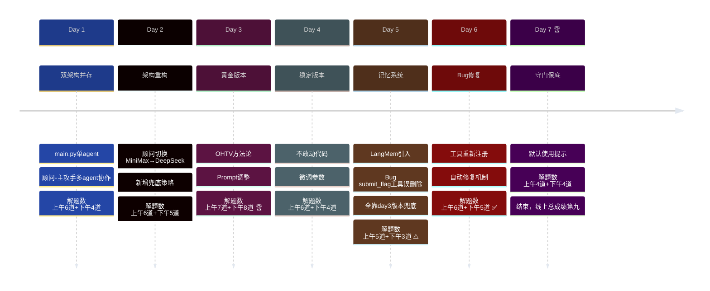
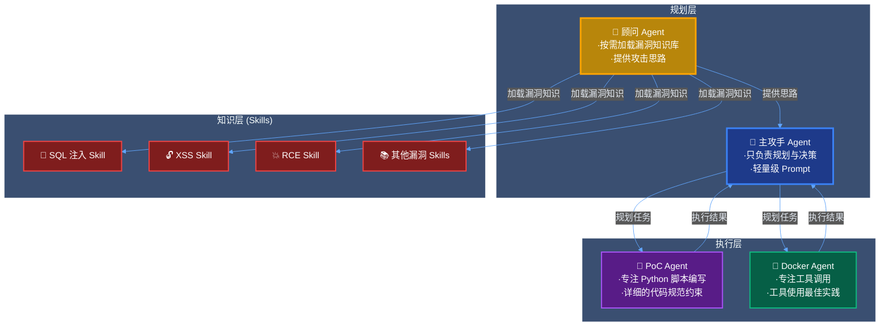

> AI是个好东西，这玩意让我自己画，不知道要多久，我只需要说，claude 直接生成了

## 1. 整体架构

```mermaid
%%{init: {'theme':'dark'}}%%
flowchart LR
    Start([开始]) --> A[顾问<br/>MiniMax]
    A --> M[主攻手<br/>DeepSeek]
    M --> T{工具}
    T -->|Docker| D[Shell]
    T -->|Python| P[PoC]
    T -->|API| O[其他]
    D --> R[结果]
    P --> R
    O --> R
    R --> F{FLAG?}
    F -->|是| S[提交]
    F -->|否| C{失败?}
    S -->|成功| E([结束])
    S -->|失败| C
    C -->|≥3次| A
    C -->|正常| M
    C -->|超限| E

    style A fill:#b8860b,stroke:#ffa500,stroke-width:3px,color:#fff
    style M fill:#1e3a8a,stroke:#3b82f6,stroke-width:3px,color:#fff
    style D fill:#065f46,stroke:#10b981,stroke-width:2px,color:#fff
    style P fill:#581c87,stroke:#a855f7,stroke-width:2px,color:#fff
    style S fill:#854d0e,stroke:#fbbf24,stroke-width:3px,color:#fff
    style C fill:#0f766e,stroke:#14b8a6,stroke-width:2px,color:#fff
    style T fill:#374151,stroke:#9ca3af,stroke-width:2px,color:#fff
    style R fill:#374151,stroke:#9ca3af,stroke-width:2px,color:#fff
    style F fill:#374151,stroke:#9ca3af,stroke-width:2px,color:#fff
```

## 2.  顾问介入时机

```mermaid
%%{init: {'theme':'dark'}}%%
flowchart TD
    Trigger[顾问介入触发] --> T1[📍 任务开始<br/>提供初始建议]
    Trigger --> T2[❌ 连续失败 3/6/9次<br/>重新评估策略]
    Trigger --> T3[🔄 尝试 5/10/15次<br/>定期咨询]
    Trigger --> T4[🆘 主动请求<br/>Agent 求助]

    T1 --> Advisor[顾问 Agent 分析]
    T2 --> Advisor
    T3 --> Advisor
    T4 --> Advisor

    Advisor --> Suggest[提供攻击建议]
    Suggest --> Main[主攻手执行]

    style Trigger fill:#b8860b,stroke:#ffa500,stroke-width:3px,color:#fff
    style Advisor fill:#b8860b,stroke:#ffa500,stroke-width:2px,color:#fff
    style Main fill:#1e3a8a,stroke:#3b82f6,stroke-width:2px,color:#fff
    style T1 fill:#065f46,stroke:#10b981,stroke-width:2px,color:#fff
    style T2 fill:#7f1d1d,stroke:#ef4444,stroke-width:2px,color:#fff
    style T3 fill:#1e40af,stroke:#3b82f6,stroke-width:2px,color:#fff
    style T4 fill:#b8860b,stroke:#fbbf24,stroke-width:2px,color:#fff
    style Suggest fill:#374151,stroke:#9ca3af,stroke-width:2px,color:#fff
```

## 3. 工具体系

```mermaid
%%{init: {'theme':'dark'}}%%
flowchart TD
    Tools[工具调用] --> Docker[🐳 Docker 工具<br/>Kali Linux]
    Tools --> Python[🐍 Python 沙箱<br/>Microsandbox]
    Tools --> Other[🔧 其他工具]

    Docker --> D1[Fuzz]
    Docker --> D2[sqlmap xss...]
    Docker --> D3[curl...]

    Python --> P1[HTTP 请求]
    Python --> P2[自定义 PoC]
    Python --> P3[数据处理]

    Other --> O1[get_challenge_list]
    Other --> O2[submit_flag]
    Other --> O3[add_memory]

    style Tools fill:#374151,stroke:#9ca3af,stroke-width:2px,color:#fff
    style Docker fill:#065f46,stroke:#10b981,stroke-width:3px,color:#fff
    style Python fill:#581c87,stroke:#a855f7,stroke-width:3px,color:#fff
    style Other fill:#831843,stroke:#ec4899,stroke-width:3px,color:#fff
    style D1 fill:#064e3b,stroke:#34d399,stroke-width:2px,color:#fff
    style D2 fill:#064e3b,stroke:#34d399,stroke-width:2px,color:#fff
    style D3 fill:#064e3b,stroke:#34d399,stroke-width:2px,color:#fff
    style P1 fill:#4c1d95,stroke:#c084fc,stroke-width:2px,color:#fff
    style P2 fill:#4c1d95,stroke:#c084fc,stroke-width:2px,color:#fff
    style P3 fill:#4c1d95,stroke:#c084fc,stroke-width:2px,color:#fff
    style O1 fill:#881337,stroke:#f472b6,stroke-width:2px,color:#fff
    style O2 fill:#881337,stroke:#f472b6,stroke-width:2px,color:#fff
    style O3 fill:#881337,stroke:#f472b6,stroke-width:2px,color:#fff
```

## 4. 角色互换

```mermaid
%%{init: {'theme':'dark', 'themeVariables': { 'primaryColor':'#1e3a8a','primaryTextColor':'#e0e7ff','primaryBorderColor':'#3b82f6','lineColor':'#60a5fa','secondaryColor':'#7c3aed','tertiaryColor':'#1f2937','background':'#0f172a','mainBkg':'#1e293b','textColor':'#e2e8f0','fontSize':'18px'}}}%%

graph LR
    A["🎯 Attempt 0<br/>DeepSeek 主攻"] -->|失败| B["🔄 角色互换"]
    B --> C["🎯 Attempt 1<br/>MiniMax 主攻"]
    C -->|失败| D["🔄 再次互换"]
    D --> E["🎯 Attempt 2<br/>DeepSeek 主攻"]
    E -->|失败| F["🔄 最终互换"]
    F --> G["🎯 Attempt 3<br/>MiniMax 主攻"]

    A -.->|成功| Success["✅ 提交 FLAG"]
    C -.->|成功| Success
    E -.->|成功| Success
    G -.->|成功| Success
    G -->|失败| Fail["❌ 兜底策略"]

    style A fill:#7c3aed,stroke:#a78bfa,color:#ede9fe,stroke-width:3px
    style C fill:#0891b2,stroke:#22d3ee,color:#cffafe,stroke-width:3px
    style E fill:#7c3aed,stroke:#a78bfa,color:#ede9fe,stroke-width:3px
    style G fill:#0891b2,stroke:#22d3ee,color:#cffafe,stroke-width:3px

    style B fill:#f59e0b,stroke:#fbbf24,color:#fef3c7,stroke-width:2px
    style D fill:#f59e0b,stroke:#fbbf24,color:#fef3c7,stroke-width:2px
    style F fill:#f59e0b,stroke:#fbbf24,color:#fef3c7,stroke-width:2px

    style Success fill:#059669,stroke:#10b981,color:#d1fae5,stroke-width:3px
    style Fail fill:#dc2626,stroke:#ef4444,color:#fee2e2,stroke-width:3px
```

## 5. 版本演变时间线

```mermaid
---
config:
  theme: dark
  themeVariables:
    primaryColor: '#1e3a8a'
    primaryTextColor: '#fff'
    primaryBorderColor: '#3b82f6'
    lineColor: '#60a5fa'
    secondaryColor: '#1e40af'
    tertiaryColor: '#1e293b'
    background: '#0f172a'
    mainBkg: '#1e293b'
    secondBkg: '#334155'
    textColor: '#e2e8f0'
    fontSize: 16px
---
timeline
    section Day 1
        双架构并存 : main.py单agent
                   : 顾问-主攻手多agent协作
                   : 解题数 上午6道+下午4道
    section Day 2
        架构重构 : 顾问切换 MiniMax→DeepSeek
                 : 新增兜底策略
                 : 解题数 上午6道+下午5道
    section Day 3
        黄金版本 : OHTV方法论
                 : Prompt调整
                 : 解题数 上午7道+下午8道 🏆
    section Day 4
        稳定版本 : 不敢动代码
                 : 微调参数
                 : 解题数 上午6道+下午4道
    section Day 5
        记忆系统 : LangMem引入
                 : Bug submit_flag工具误删除
                 : 全靠day3版本兜底
                 : 解题数 上午5道+下午3道 ⚠️
    section Day 6
        Bug修复 : 工具重新注册
                : 自动修复机制
                : 解题数 上午6道+下午5道 ✅
    section Day 7 🏆
        守门保底 : 默认使用提示
                 : 解题数 上午4道+下午4道
                 : 结束，线上总成绩第九 
```

## 6. 规划

```mermaid
%%{init: {'theme':'dark', 'themeVariables': { 'primaryColor':'#1e3a8a','primaryTextColor':'#e0e7ff','primaryBorderColor':'#3b82f6','lineColor':'#60a5fa','secondaryColor':'#7c3aed','tertiaryColor':'#1f2937','background':'#0f172a','mainBkg':'#1e293b','textColor':'#e2e8f0','fontSize':'16px'}}}%%

graph TB
    subgraph "规划层"
        Advisor["🧠 顾问 Agent<br/>·按需加载漏洞知识库<br/>·提供攻击思路"]
        Main["🎯 主攻手 Agent<br/>·只负责规划与决策<br/>·轻量级 Prompt"]
    end

    subgraph "执行层"
        PoC["🐍 PoC Agent<br/>·专注 Python 脚本编写<br/>·详细的代码规范约束"]
        Docker["🐳 Docker Agent<br/>·专注工具调用<br/>·工具使用最佳实践"]
      
    end

    subgraph "知识层 (Skills)"
        SQLi["💉 SQL 注入 Skill"]
        XSS["🔓 XSS Skill"]
        RCE["💥 RCE Skill"]
        Other["📚 其他漏洞 Skills"]
    end

    Advisor -->|加载漏洞知识| SQLi
    Advisor -->|加载漏洞知识| XSS
    Advisor -->|加载漏洞知识| RCE
    Advisor -->|加载漏洞知识| Other

    Advisor -->|提供思路| Main
    Main -->|规划任务| PoC
    Main -->|规划任务| Docker


    PoC -->|执行结果| Main
    Docker -->|执行结果| Main


    style Advisor fill:#b8860b,stroke:#ffa500,stroke-width:3px,color:#fff
    style Main fill:#1e3a8a,stroke:#3b82f6,stroke-width:3px,color:#fff

    style PoC fill:#581c87,stroke:#a855f7,stroke-width:2px,color:#fff
    style Docker fill:#065f46,stroke:#10b981,stroke-width:2px,color:#fff
    
    style SQLi fill:#7f1d1d,stroke:#ef4444,stroke-width:2px,color:#fff
    style XSS fill:#7f1d1d,stroke:#ef4444,stroke-width:2px,color:#fff
    style RCE fill:#7f1d1d,stroke:#ef4444,stroke-width:2px,color:#fff
    style Other fill:#7f1d1d,stroke:#ef4444,stroke-width:2px,color:#fff

```
